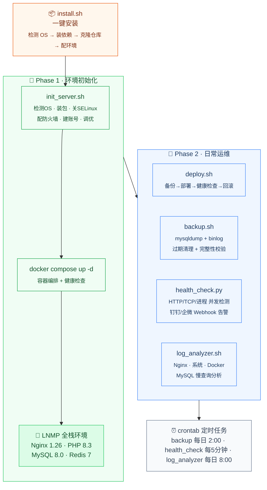

# server-deploy-toolkit

服务器自动化部署与运维工具箱——把实施工程师的手工活写成脚本，一行命令搞定。

[](https://github.com/lzkzzz/server-deploy-toolkit/actions)
[](https://github.com/lzkzzz/server-deploy-toolkit)
[](https://github.com/lzkzzz/server-deploy-toolkit)
[](https://github.com/lzkzzz/server-deploy-toolkit)
[](LICENSE)

## 运行演示

```console
# 服务器初始化
$ sudo bash init_server.sh
============================================
  server-deploy-toolkit - 服务器初始化脚本
============================================

[INFO] 检测到系统类型：centos
[INFO] 正在安装基础软件包...
[INFO] 基础软件包安装完成
[INFO] 正在关闭 SELinux...
[INFO] SELinux 已关闭
[INFO] 正在配置防火墙...
[INFO] 防火墙配置完成（已开放 22, 80, 443 端口）
[INFO] 正在创建运维账号 ops ...
[INFO] 运维账号 ops 创建完成
[INFO] 正在设置时区...
[INFO] 时区已设置为 Asia/Shanghai
[INFO] 正在优化系统参数...
[INFO] 系统参数优化完成
[INFO] 初始化完成！

# 启动 LNMP 环境
$ docker compose up -d
[+] Running 5/5
 ✔ Network app-net   Created
 ✔ Container redis   Healthy
 ✔ Container php     Healthy
 ✔ Container mysql   Healthy
 ✔ Container nginx   Started

# 健康检查
$ python health_check.py
==================================================
  服务健康检查报告
  时间：2025-07-24 10:30:00
==================================================
  ✅ Nginx           (12.34ms)
  ✅ PHP-FPM         (1.23ms)
  ✅ MySQL           (3.45ms)
  ✅ Redis           (0.89ms)
  ✅ Docker Daemon   (2.10ms)
  ✅ SSH Daemon      (5.67ms)
--------------------------------------------------
  总计: 6 | 正常: 6 | 异常: 0
```

## 工作流程



## 功能列表

| 脚本 | 行数 | 功能 | 技能关键词 |
|------|------|------|---------|
| `init_server.sh` | 160 | 服务器初始化（装包/关SELinux/配防火墙/建账号/调优） | Shell 脚本、OS 兼容、SELinux、firewalld/ufw、系统调优 |
| `deploy.sh` | 170 | 应用自动部署+健康检查+自动回滚 | 蓝绿部署、回滚策略、参数解析、进程管理 |
| `health_check.py` | 180 | 多线程健康监控（HTTP/TCP/进程）+钉钉/企微告警 | Python 多线程、Socket、HTTP 探活、Webhook |
| `backup.sh` | 130 | MySQL 全量+ binlog 增量备份+自动清理 | mysqldump、binlog、备份策略、Gzip 校验 |
| `log_analyzer.sh` | 150 | 日志分析（Nginx 状态码/IP/慢请求、系统错误、Docker） | awk、journalctl、慢查询、异常检测 |
| `install.sh` | 100 | 一条命令安装本工具到任意服务器 | 自动化安装、依赖检测、环境配置 |
| `test_runner.sh` | 120 | 脚本自测（语法/函数/配置完整性） | 自动化测试、CI 前置、代码规范 |
| `docker-compose.yml` | — | LNMP 容器编排+健康检查+资源限制 | Docker Compose、多服务编排、健康检查 |
| `.env.example` | — | 集中配置管理 | 12-Factor App、环境变量、安全配置 |

## 快速开始

### 一键安装

```bash
curl -sSL https://raw.githubusercontent.com/lzkzzz/server-deploy-toolkit/main/install.sh | sudo bash
```

### 手动使用

```bash
# 1. 初始化服务器（裸 CentOS/Ubuntu）
sudo bash init_server.sh

# 2. 部署 LNMP 环境
docker compose up -d

# 3. 部署应用
bash deploy.sh --app=myapp --version=1.0.0

# 4. 定时任务（日常运维）
0 2 * * * bash /opt/server-deploy-toolkit/backup.sh
*/5 * * * * python /opt/server-deploy-toolkit/health_check.py --json --alert
0 8 * * * bash /opt/server-deploy-toolkit/log_analyzer.sh --type=all
```

## 项目结构

```
server-deploy-toolkit/
├── init_server.sh            # 服务器初始化（160行）
├── docker-compose.yml        # LNMP 容器编排
├── deploy.sh                 # 应用自动部署+回滚（170行）
├── health_check.py           # 健康监控+告警（180行）
├── backup.sh                 # MySQL 备份+清理（130行）
├── log_analyzer.sh           # 日志分析（150行）
├── install.sh                # 一键安装（100行）
├── test_runner.sh            # 自动化自测（120行）
├── .env.example              # 配置模板
├── .github/workflows/ci.yml  # CI 自动检查
├── nginx/ mysql/ php/ redis/ # 中间件配置
├── docs/
│   ├── 部署手册.md             # 实施部署 SOP
│   └── 运维手册.md             # 日常运维 SOP
└── README.md
```

## 技术栈

- **Shell** — 部署/备份/日志分析（脚本总计 600+ 行）
- **Python** — 多线程健康监控 + Webhook 告警
- **Docker / Docker Compose** — LNMP 容器化部署 + 健康检查
- **MySQL** — mysqldump 全量 + binlog 增量备份
- **CI/CD** — GitHub Actions 自动语法检查
- **Nginx / Redis / PHP-FPM** — 标准 Web 技术栈

## 支持的平台

| 系统 | 版本 |
|------|------|
| CentOS | 7 / 8 / 9 |
| Rocky Linux | 8 / 9 |
| Ubuntu | 20.04 / 22.04 / 24.04 |

## 文档

- [部署手册](docs/部署手册.md) — 环境要求 → 安装步骤 → 验证清单 → 常见故障排查
- [运维手册](docs/运维手册.md) — 日常巡检 → 备份恢复 → 故障处理预案 → 安全加固

## CI 状态


## License

MIT
